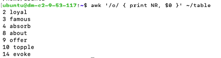
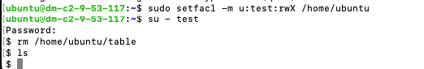

## Задание:
Домашнее задание к лекции 3 LUNUX:
1.  Создайте пользователя docker и группу docker. Создайте папку /mnt/docker и назначьте пользователя docker её владельцем.
2.  Создайте в домашней директории файл table и внесите в него список слов (по одному слову в строке): speak, loyal, famous, absorb, ice, skill, galaxy, about, offer, topple, argue, unusual, sing, evoke. Используя awk, выведите все слова, содержащие букву o, и номер строки, где они находятся.
3.  Создайте пользователя test и задайте ему пароль из 16 символов, используя подсказки из pwgen --help. Добавьте пользователя в группу с таким же именем. Затем, войдите под пользователем test и удалите файл table от его имени.

## Решение 
## Индивидуальная часть:
Задание 1
```bash
# 1. Создать группу docker
sudo groupadd docker

# 2. Создать пользователя docker и добавить его в группу docker
sudo useradd -m -g docker docker

# 3. Создать директорию /mnt/docker
sudo mkdir -p /mnt/docker

# 4. Назначить владельцем директории пользователя docker
sudo chown docker:docker /mnt/docker
```
Задание 2
```bash
# 1. Создать файл table в домашней директории
cat > ~/table <<EOF
speak
loyal
famous
absorb
ice
skill
galaxy
about
offer
topple
argue
unusual
sing
evoke
EOF

# 2. Используя awk, выведите все слова, содержащие букву o, и номер строки, где они находятся.
awk '/o/ { print NR, $0 }' ~/table

```
Задание 3
```bash
# 1.Установка pwgen
sudo apt install pwgen -y

# 2.Сгенерировать пароль из 16 символов
pwgen 16 1
evieRae7feroot9o

# 3.Создать пользователя test
sudo groupadd test

# 4. Добавить пользователя в группу test
sudo useradd -m -g test test

# 5. Задать пароль пользователю test
echo 'test:evieRae7feroot9o' | sudo chpasswd

# 6. Удалить файл ~/table от имени test
sudo chown test:test /home/ubuntu/table
sudo apt update
sudo apt install acl
sudo setfacl -m u:test:rwX /home/ubuntu
su - test
rm /home/ubuntu/table


```