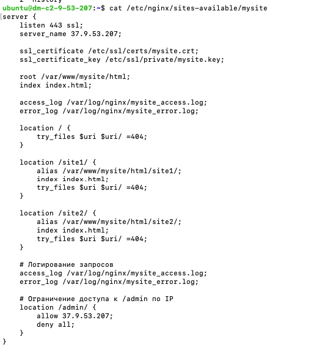
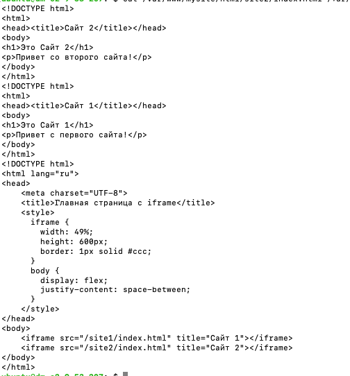
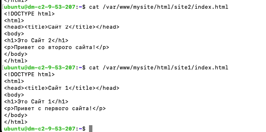
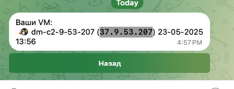
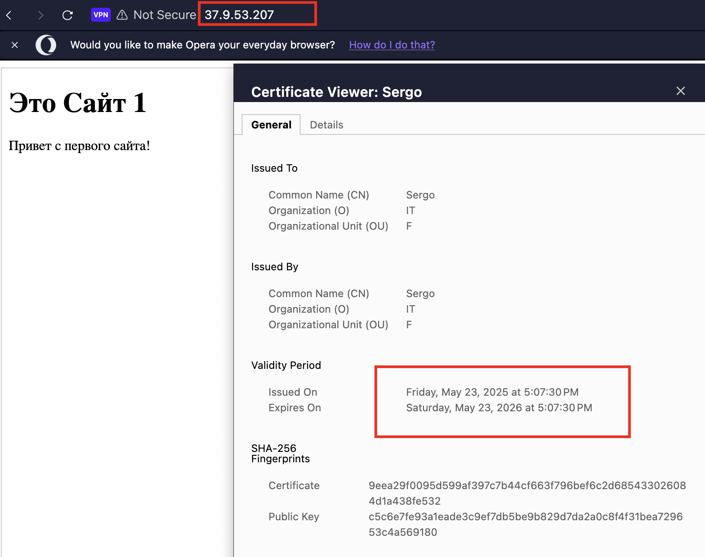
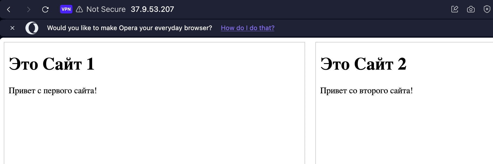

## Задание:
Домашнее задание к лекции 4 NGNIX:
1. Создать виртуальную машину с Ubuntu и установить Nginx.
2. Создать HTML-страницу, в которой два сайта подключены через iframe. Атрибут src у iframe должен ссылаться на тот же сервер, на котором расположен сам HTML-файл.
3. Настроить Nginx для доступа к обоим сайтам.
4. Прислать скриншоты конфигурационного файла и HTML-страницы.
5. Настроить HTTPS с самоподписанным сертификатом или Let’s Encrypt.
6. Настроить логирование запросов.
7. Ограничить доступ к административной части сайта по IP.

## Решение 
# /etc/nginx/sites-available/mysite

# /var/www/mysite/html/index.html

# /var/www/mysite/html/site1/index.html
# /var/www/mysite/html/site2/index.html

Рабочий сайт:

