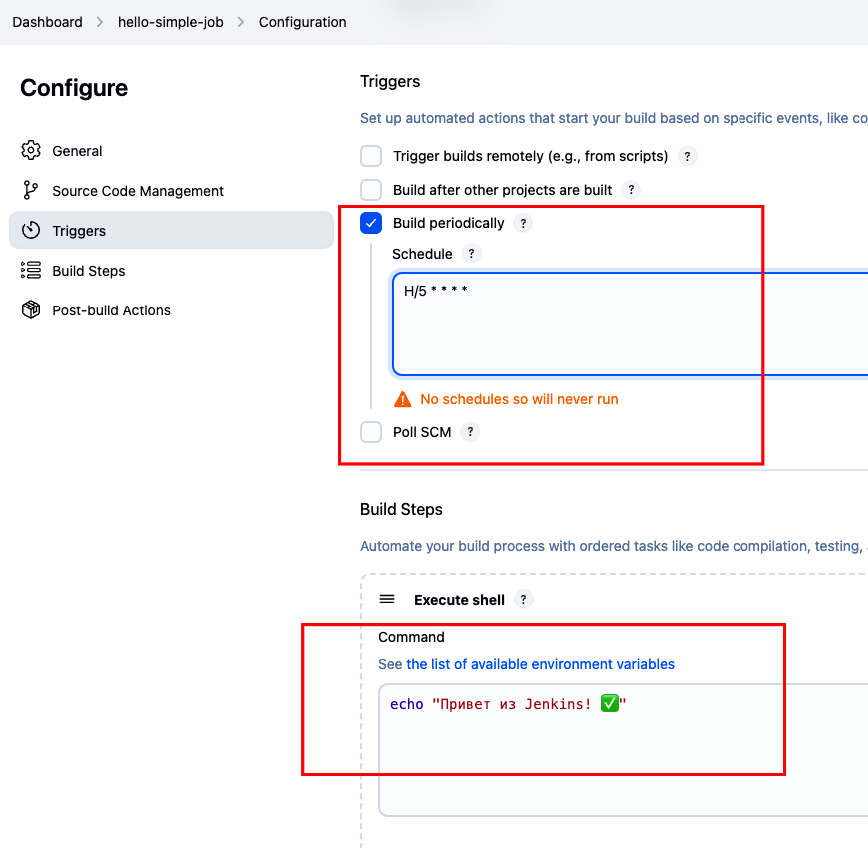

Домашнее задание к лекции 5 CI/CD:

## Задание:

1.  Установить Jenkins c использованием docker
2.  Установить 6 плагинов:
•  Scriptler
•  Green Balls
•  ChuckNorris
•  Multiple SCMs Plugin
•  Email Extension Plugin
•  Role-based Authorization Strategy
3.  Отключить анонимный доступ через Role Strategy Plugin.
4.  Создать свободный (Free-style) job с простым build step, который выводит сообщение в консоль.
•  Запустить сборку.
•  Настроить периодический запуск.
5.  Настроить сборку любого open-source проекта в Jenkins.
•  Выходной результат — какой-либо артефакт (например, jar или zip архив).

## Решение 
# Клонировал репозиторий HW5 на VM
git clone https://github.com/SergeySelya/Lesta.git
# Запустил jenkins с контейнера
sudo apt install docker.io
docker build -t myjenkins .
docker run -d --name jenkins --restart unless-stopped -p 8080:8080 -p 50000:50000 myjenkins
# Открываем ui jenkins 
http://37.9.53.49:8080

# добавляем плагин Role-based Authorization Strategy:
http://37.9.53.49:8080/manage/pluginManager/available
# в разделе Auth ставим Role-based Strategy
http://37.9.53.49:8080/manage/configureSecurity/
# копируем скрипт  "init-user.groovy" в докер контейнер и перезапускаем
Этот скрипт создаёт пользователя:
Логин: admin
Пароль: admin123
И отключает доступ для анонимных пользователей.

docker exec -it 227c24017108 bash
mkdir -p /var/jenkins_home/init.groovy.d
exit
# копирование Groovy-скрипта в контейнер:
docker cp init-user.groovy 227c24017108:/var/jenkins_home/init.groovy.d/init-user.groovy
docker restart 227c24017108
# Удалить скрипт из контейнера:
docker exec -it 227c24017108 rm /var/jenkins_home/init.groovy.d/init-user.groovy

# создание проекта hello-simple-job с запуском по cron

# добавил пайплайн сборки open-source Java-проека (https://github.com/apache/commons-lang.git)
http://37.9.53.49:8080/job/undertow-build/

