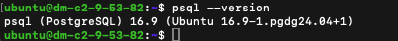
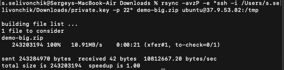
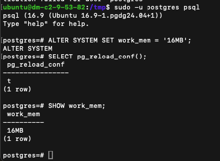
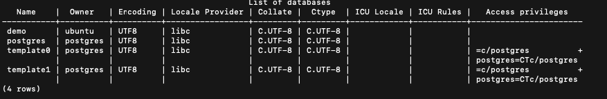
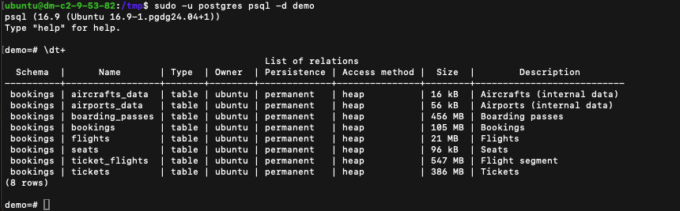
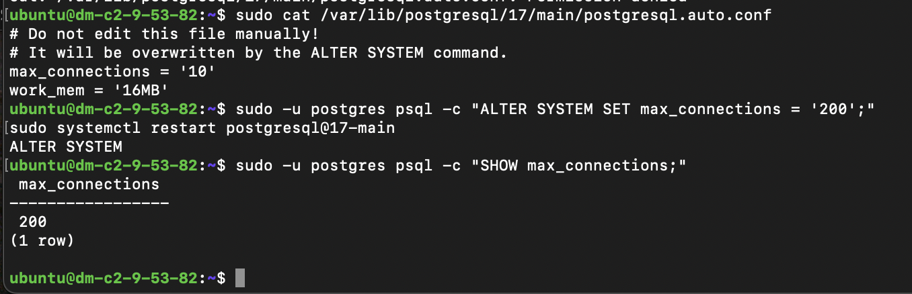

## Задание:
Домашнее задание к лекции 6. DB
Task 1 Install/Restore DB 
1. Установите (postgres-16, unzip, sysbench) из доступных репозиториев через apt install.
2. Создайте юзера БД "ubuntu" ( https://www.postgresql.org/docs/16/sql-createrole.html) и назначьте права как в 
примере ниже:
CREATE USER ubuntu WITH PASSWORD 'ololo' SUPERUSER;
3. Дальнейшие действия выполняйте от юзера ubuntu, прим:
ubuntu@dm-c2-9-53-84:~$ psql postgres
psql (16.9 (Ubuntu 16.9-0ubuntu0.24.04.1))
Type "help" for help.
postgres=# 
4. Загрузите дамп demo-big.zip (ссылка внизу страницы) на свой хост, распакуйте и восстановите его в БД 
инструментом командной строки psql: 
# : 
# 1. c Google Drive.
# 2. rsync, :
rsync -avzP -e "ssh -i Downloads/private.key -p 22" demo-big.zip ubuntu@37.9.53.84:/tmp
5. Исправить конфиги postgres двумя способами, через конфиг файл:
vim /etc/postgresql/16/main/postgresql.conf
# 
shared_buffers = 256MB
и через командную консоль:
# 
ALTER SYSTEM SET work_mem = '16MB';
# select pg_reload_conf() ( )
Когда параметры меняются через консоль, они записываются не в основной файл конфигурации, а в 
дополнительный postgresql.auto.conf. Значения в postgresql.auto.conf приоритетнее аналогичных в postgresql.conf
6. Сделайте рестарт сервиса postgres.
systemctl restart postgresql
7. После успешного восстановления дампа - запишите все ранее выполненные команды + список баз/таблиц (вывод 
команд из блока ниже) :
psql -l 
# demo
\dt+

Task 2 Sysbench 
Загрузите файл demo_benchmark.lua (ссылка внизу страницы) на ваш хост. 
Запустите sysbanch с данными параметрами, дополнив кредами, созданными ранее( https://severalnines.com/blog
/how-benchmark-postgresql-performance-using-sysbench/ ):
sysbench --db-driver=pgsql --pgsql-host=127.0.0.1 --pgsql-db=demo --threads=12 --report-interval=15 --
time=30 demo_benchmark.lua run
 Решите проблему с выполнением бэнчмарка, не меняя параметров запуска sysbench.
Приложите скрины с успешным выполнением бэнчмарка/локализацией проблемы + описанием как решали.


Task 3* Optimize query 
 Оптимизируйте план и время выполнения данного запроса в вашем demo_benchmark.lua:
SELECT ticket_no,passenger_id, passenger_name FROM tickets WHERE book_ref = '521C53';
* подсказка, в таблице чего-то не хватает.. Можно почитать в лекции про операции с БД.
В результат приложите скрины выполнения запроса sysbench: До/После. Как диагностировали проблему и что сделал
и для оптимизации . 
P.S. дамп demo-big.zip и файл demo_benchmark.lua лежат тут https://drive.google.com/drive/folders
/1XeTKgO5YiZrxKE3691_yvZFZ5kw6yhID
ФОРМАТ СДАЧИ ДЗ: выполнение ДЗ на наших машинах, pdf-файл с ответами и скринами
## Решение TASK1

1) Установка postgresql-16, unzip, sysbench через apt
```bash
sudo apt update

# Установка unzip и sysbench
sudo apt install -y unzip sysbench

# Добавление репозитория PostgreSQL 16
sudo apt install -y curl gnupg ca-certificates
curl -fsSL https://www.postgresql.org/media/keys/ACCC4CF8.asc | sudo gpg --dearmor -o /etc/apt/trusted.gpg.d/postgresql.gpg
echo "deb http://apt.postgresql.org/pub/repos/apt $(lsb_release -cs)-pgdg main" | sudo tee /etc/apt/sources.list.d/pgdg.list
sudo apt update
sudo apt install -y postgresql-16
```

2)Создание пользователя ubuntu с правами SUPERUSER в PostgreSQL

```bash
# Вход в PostgreSQL под системным пользователем postgres
sudo -u postgres psql
# Внутри psql выполнил:
CREATE USER ubuntu WITH PASSWORD 'ololo' SUPERUSER;
\q
```

3) Выполнение команд от имени пользователя ubuntu
```bash
sudo adduser ubuntu
sudo usermod -aG sudo ubuntu

su - ubuntu
```
4. Загрузка дампа demo-big.zip, распаковка и восстановление в БД
```bash
rsync -avzP -e "ssh -i /Users/s.selivonchik/Downloads/private.key -p 22" demo-big.zip ubuntu@37.9.53.82:/tmp
```


```bash
# расспаковка и восстановление дампа
sudo apt install unzip
unzip demo-big.zip

psql -U ubuntu -d demo -f /tmp/demo-big-20170815.sql
```

5. 
a) Меняем конфиг через конфигурационный файл postgresql.conf
```bash
sudo vim /etc/postgresql/16/main/postgresql.conf
sudo systemctl restart postgresql
# set - shared_buffers = 256MB
```
b) Меняем конфиг Через SQL-консоль (ALTER SYSTEM)
```bash
sudo -u postgres psql
# Выполни команду:
ALTER SYSTEM SET work_mem = '16MB';
# Применение изменений:
SELECT pg_reload_conf();
# Проверь, применилось ли:
SHOW work_mem;
```

```bash
psql -l 
```

```bash
sudo -u postgres psql -d demo
\dt+
```



## Решение TASK2
 
```bash
# Шаг 1: Убедиться, что sysbench установлен
sudo apt update
sudo apt install sysbench postgresql libpq-dev
# Шаг 2: Скачать demo_benchmark.lua
rsync -avzP -e "ssh -i /Users/s.selivonchik/Downloads/private.key -p 22" demo_benchmark.lua ubuntu@37.9.53.82:/tmp
# Шаг 3: Проверка доступа к базе PostgreSQL
psql -U ubuntu -h 127.0.0.1 -d demo
# Password - ololo
# Шаг 4: Запуск бенчмарка
sysbench \
  demo_benchmark.lua \
  --db-driver=pgsql \
  --pgsql-host=127.0.0.1 \
  --pgsql-port=5432 \
  --pgsql-user=ubuntu \
  --pgsql-password=ololo \
  --pgsql-db=demo \
  --threads=12 \
  --report-interval=15 \
  --time=30 \
  run

# АНАЛИЗ и ФИКС
# при запуске бенчмерча появилась ошибка об ограничении connections.Попробовал сначала проверить через команду фактическое ограничение - оказалось порог 10. хотя в postgresql.conf max_connections=200.
# Решил проверить postgresql.auto.conf тк он перезаписывает ostgresql.conf при запуске сервера . В этом файле данный параметр и перезаписывался , пришлось его поменять через ALTER SYSTEM SET.
sudo -u postgres psql -c "SHOW max_connections;"
sudo cat /var/lib/postgresql/17/main/postgresql.auto.conf

sudo -u postgres psql -c "ALTER SYSTEM SET max_connections = '200';"
sudo systemctl restart postgresql@17-main

```

