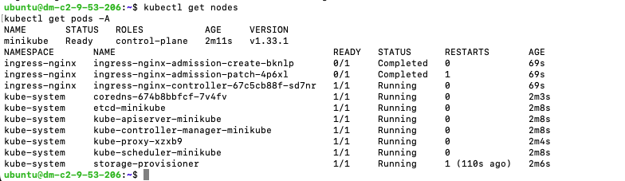

## Задание:

Задание 1:
•  Установить minikube  и запустить на нем кластер
•  Запустить на нем ingress controller
•  Установить kubectl

Задание 2:
Опубликовать приложение lesta-start:7.1 на кластере
•  подготовить deployment
•  подготовить service
•  подготовить ingress

Задание 3:
Подготовить helm chart  на основании манифестов из задания 2

## Решение:
## Задание 1
```bash
#установка docker
sudo apt update
sudo apt install -y docker.io
sudo usermod -aG docker $USER
newgrp docker

# создал новую вм для разворачивания minikube
37.9.53.206

# Установим Minikube (если еще не установлен)
curl -LO https://storage.googleapis.com/minikube/releases/latest/minikube-linux-amd64
sudo install minikube-linux-amd64 /usr/local/bin/minikube

# запуск кластера
minikube start --driver=docker

# установка kubectl
curl -Ls https://dl.k8s.io/release/stable.txt
VERSION=$(curl -Ls https://dl.k8s.io/release/stable.txt)
curl -LO "https://dl.k8s.io/release/${VERSION}/bin/linux/amd64/kubectl"
chmod +x kubectl
sudo mv kubectl /usr/local/bin/
kubectl version --client

# установка Ingress Controller
minikube addons enable ingress
kubectl get pods -n kube-system -l app.kubernetes.io/name=ingress-nginx

```
